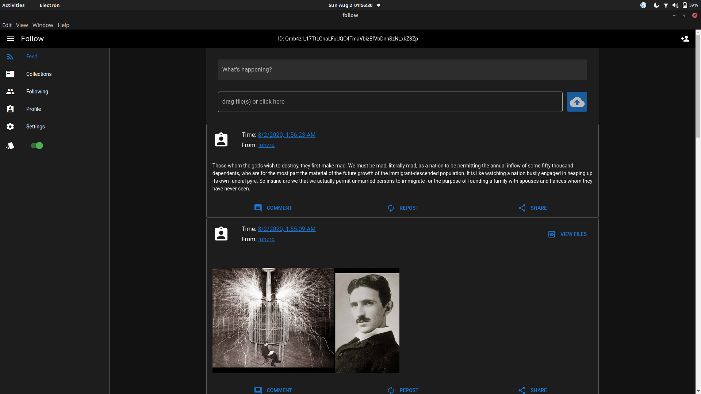
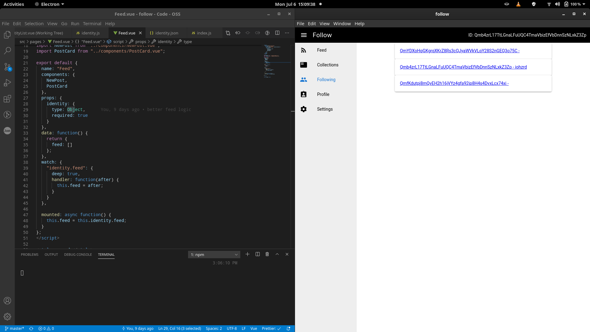
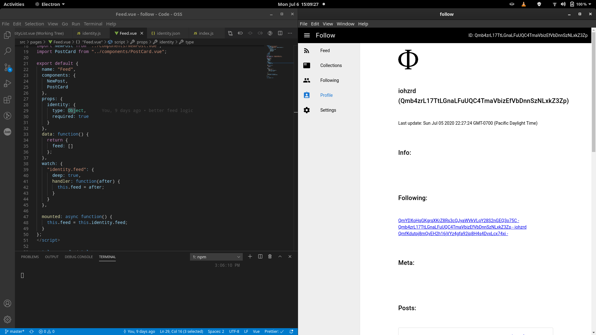

# Follow

decentralized, censorship resistant publication and subscription on IPFS

## Status

Alpha

## Warnings

This app will override anything you've previously published to your IPFS id (via IPNS)
merging planned for future...

Also, this app will probably break frequently for the foreseeable future so don't get attached to your posts just yet ;)

If a breaking change occurs, try manually editing your identity object, stored in the "user data" directory

## Architecture

The core of follow is it's concept of an identity.

The identity object is where the data about the users posts, the people they "follow", and whatever else they might want to include is stored.

An identity object is the fundamental unit that we'll use to create a distributed social graph.

First, we connect to IPFS and retrieve our ID.

On first boot, we instantiate a new "Identity" object, which is ultimately saved to disk as a json file.

Most of the identity logic is contained in the Identity class:
`src/modules/identity.js`

Identity object structure:

root level keys:

```
{
    "av": "", // base64 encoded image data for "avatar"
    "aux": {}, // an object for arbitrary, user-defined data. Ex.
    "dn": "", // user-defined display name
    "id": "", // users IPFS ID
    "meta": [""], // list of CIDs that represent meta objects
    "posts": [""], // a list of CIDs that represent post objects
    "following": [""], // a list of ID's the user follows
    "ts": 10000, // UTC adjusted UNIX timestamp of the identities last edit
}
```

aux object:

```
{
    "btc": "",
    "website": ""
}
```

post object:

```
{
    "body": "", // the text body of the post
    "publisher": "", // original publisher, will be used for "re-post" functionality
    "magnet": "", // a webtorrent magnet link for redundancy
    "cid": "", // IPFS CID of the root directory of the post
    "files": [], // a list of file paths, relative to the user data directory
    "ts": 0 // UTC adjusted UNIX timestamp of the post
}
```

meta object:

```
{
    "TODO": "" //
}
```

We cache every post (user and following) object and "post body"(text) to disk for faster load times, and we automatically pin post CIDs to strengthen the network. ID caches follow a strict directory structure.

Once an identity object has been generated and saved to disk, it is "uploaded" and "pinned" via IPFS.
Then, in an attempt to abide by unix philosophy, we publish the identity CID to IPNS wrapped in a directory, so other things can be stored there as well.

TODO: recursively merge new publication with the "root directory" of previously published record.

The users identity object CID can now be retrieved by querying IPNS with their ID and the object itself can be downloaded.

Once a user "follows" another user, the process of fetching their posts is done automatically. The posts are presented chronologically in a "feed" with the all posts from all the other ID's the user follows.

Identity objects _will_ be automatically re-fetched periodically, followed by their new posts.

## Screenshot





## How to run

install and run IPFS as daemon.

### Windows

- download [ipfs](https://github.com/ipfs/go-ipfs/releases/download/v0.6.0/go-ipfs_v0.6.0_windows-amd64.zip)
- extract contents to: `C:\Program Files\go-ipfs\`
- run: [ipfs_daemon.ps1](ipfs_daemon.ps1)

### Linux

install ipfs via your package manager

then you can make a systemd service to have it run automatically

```
mkdir -p ~/.config/systemd/user/
nano ~/.config/systemd/user/ipfs.service
```

systemd service file: [ipfs.service](ipfs.service)

```
sudo systemctl enable ~/.config/systemd/user/ipfs.service
sudo systemctl restart ipfs
```

### Ensure ipfs will accept http api connections

```
ipfs init
ipfs config Addresses.API /ip4/0.0.0.0/tcp/5001
ipfs config --json API.HTTPHeaders.Access-Control-Allow-Origin '["http://localhost:8964", "http://127.0.0.1:5001", "https://webui.ipfs.io"]'
ipfs config --json API.HTTPHeaders.Access-Control-Allow-Methods '["PUT", "GET", "POST"]'
```

Reference: https://github.com/INFURA/tutorials/wiki/IPFS-and-CORS

### Run IPFS

```
ipfs daemon
```

### Clone the repo and run

```
git clone git@github.com:iohzrd/follow.git
cd follow
npm install
npm start
```

## TODO

- bundle IPFS binaries and manage execution
- change the post list to only contain CID strings, save post objects to file
- periodically update identities you follow...
- periodically re-publish self identity
- enable file in posts
- per post comments via pubsub
- progress events for spinners and such
- cache and pin content, load cached by default. fetch new async
- "re-post" / mirror a post
- "remix"(clone and modify) other users "playlists"...
- add banners to following view (amount of new posts etc...)
- post view (file manager?)
- meta view ("playlists" / arbitrary user defined categorization)
- seed posts as web torrents (for redundancy)
- sign posts (probably the list of CIDs or maybe body)
- settings view (iframe ipfs web-gui? lol)
- traverse through ID's (profile.following -> profile view...)
- use IPLD
- TOR?
- rss / json-feed?
-

## Follow me

```
Qmb4zrL17TtLGnaLFuUQC4TmaVbizEfVbDnnSzNLxkZ3Zp
```

and

```
QmYDXoHqGKgrqXKrZ8Rs3cQJyaWVkVLqY28S2nGEQ3o75C
```

## Shilling...

https://www.patreon.com/user?u=18416317&fan_landing=true

## License

[MIT](LICENSE)
